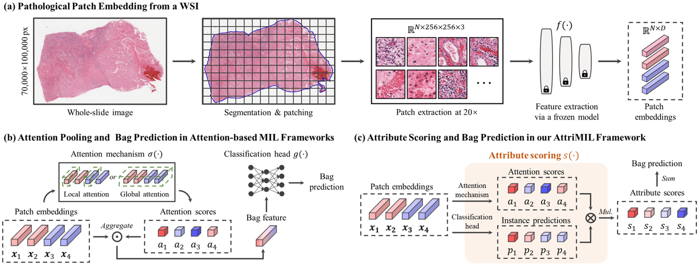
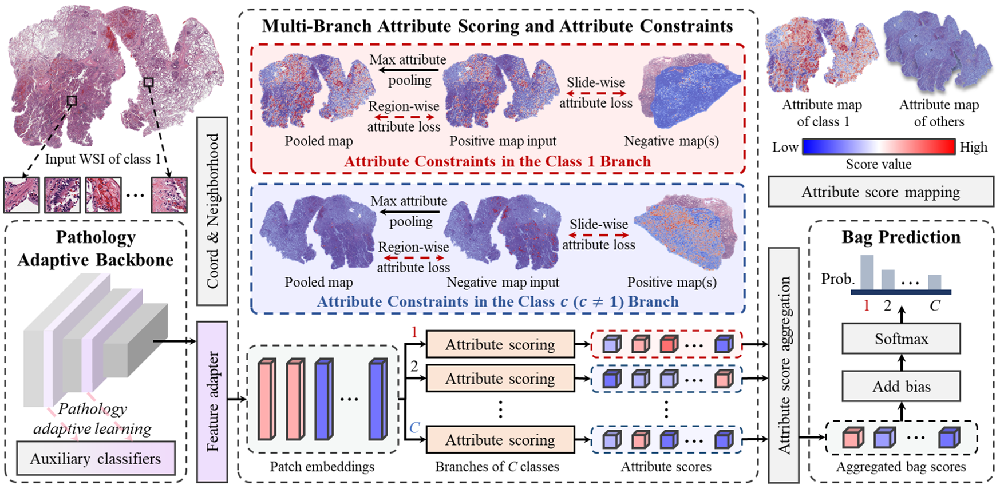
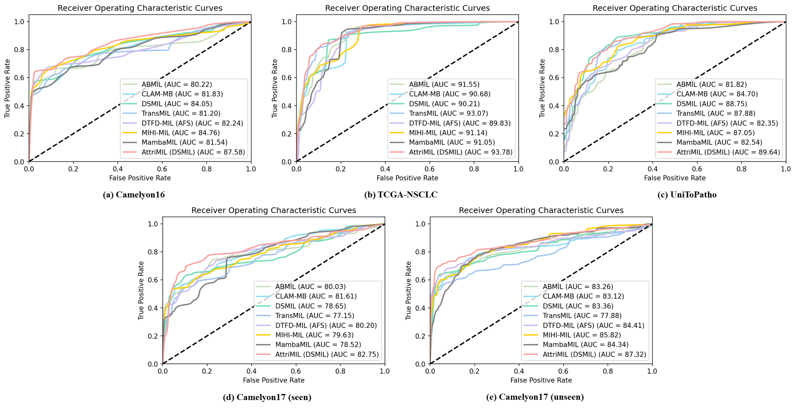

# AttriMIL: Revisiting attention-based multiple instance learning for whole-slide pathological image classification from a perspective of instance attributes
The official implementation of AttriMIL (published at _Medical Image Analysis_ 2025).

## 1. Introduction
### 1.1 Background
WSI classification typically requires the MIL framework to perform two key tasks: bag classification and instance discrimination, which correspond to clinical diagnosis and the localization of disease-positive regions, respectively. Among various MIL architectures, attention-based MIL frameworks address both tasks simultaneously under weak supervision and thus dominate pathology image analysis. However, attention-based MIL frameworks face two challenges:

(i) The incorrect measure of pathological attributes based on attention, which may confuse diagnosis.

(ii) The negligence of modeling intra-slide and inter-slide interaction, which is essential to obtain robust semantic representation of instances.

<p align="center">
     <br />
    <em> 
    Figure 1. Illustration of the workflow of attention-based MIL frameworks and the attribute scoring mechanism in AttriMIL.
    </em>
</p>

To overcome these issues, we propose a novel framework named attribute-aware multiple instance learning (AttriMIL) tailored for pathological image classification. 

(i) To identify the pathological attributes of instances, AttriMIL employs a multi-branch attribute scoring mechanism, where each branch integrates attention pooling with the classification head, deriving precise estimation of each instance's contribution to the bag prediction. 

(ii) Considering the intrinsic correlations between image patches in WSIs, we introduce two constraints to enhance the MIL framework's sensitivity to instance attributes.

(iii) Inspired by parameter-efficient fine-tuning techniques, we design a pathology adaptive learning strategy for efficient pathological feature extraction. This optimized backbone empowers AttriMIL to model instance correlations across multiple feature levels.

### 1.2. Framework
Figure 2 presents an overview of AttriMIL, which comprises three main components: (1) a pathology adaptive backbone for extracting optimized instance-level features, (2) multi-branch attribute scoring mechanism with attribute constraints, and (3) score aggregation and bag prediction. In this section, we first revisit multiple instance learning and attention-based frameworks, followed by a detailed description of AttriMIL.

<p align="center">
     <br />
    <em> 
    Figure 2. Overview of the proposed AttriMIL.
    </em>
</p>

### 1.3 Performance
AttriMIL achieves the state-of-the-art performance on four benchmarks, showcasing the superior bag classification performance, generalization ability, and instance localization capability. Additionally, AttriMIL is capable of identifying bag with a small proportion of target regions.

<p align="center">
     <br />
    <em> 
    Figure 3. Quantative comparison of the state-of-the-art WSI classification algorithms.
    </em>
</p>

## 2. Quick Start
### 2.1 Installation
AttriMIL is extended from [CLAM]([https://github.com/microsoft/CvT](https://github.com/mahmoodlab/CLAM)).Assuming that you have installed PyTorch and TorchVision, if not, please follow the [officiall instruction](https://pytorch.org/) to install them firstly. 
Intall the dependencies using cmd:
``` sh
conda env create -f env.yml
```
The code is developed and tested using pytorch 1.10.0. Other versions of pytorch are not fully tested.

### 2.2 Data preparation
Data preparation based on CLAM, including tissue segmentation, patching, and feature extraction. In comparison to traditional process, we introduce a neiboorhood generation process and use pathology-adaptive learning for instance-level feature extraction.
``` sh
python create_3coords.py  # generate neighbor indices
python coord_to_feature.py  # incorporate the indices to feature (h5) files
```
The final data following the structure:
```bash
FEATURES_DIRECTORY/
    ├── h5_files
            ├── slide_1.h5
            ├── slide_2.h5
            └── ...
    └── pt_files
            ├── slide_1.pt
            ├── slide_2.pt
            └── ...
```
where each .h5 file contains an array of extracted features along with their patch coordinates and neighbor indices.

### 2.3 Pretrained Weights
Pretrained weights are based on ResNet18 ImageNet, ResNet18 SimCLR. We follow [DSMIL](https://github.com/binli123/dsmil-wsi/tree/master) for generating the SSL features. Surely, you can also use other pre-trained models.

### 2.4 Training and Testing
Training your AttriMIL:
``` sh
python trainer_attrimil_abmil.py
```
Note that, the AttriMIL+DSMIL and AttriMIL+TransMIL will be released soon.

``` sh
python tester_attrimil_abmil.py
```
The visual results can directly capture the disease-positive regions, which is encouraging.

<p align="center">
     <br />
    <em> 
    Figure 4. Qualitative comparison of the state-of-the-art WSI classification algorithms.
    </em>
</p>

## 3. Citation
If you find this work or code is helpful in your research, please cite:

```
@article{cai2025attrimil,
  title={AttriMIL: Revisiting attention-based multiple instance learning for whole-slide pathological image classification from a perspective of instance attributes},
  author={Cai, Linghan and Huang, Shenjin and Zhang, Ye and Lu, Jinpeng and Zhang, Yongbing},
  journal={Medical Image Analysis},
  pages={103631},
  year={2025},
  publisher={Elsevier}
}
```

## 4. Contributing
Thanks to the following work for improving our project：
- CLAM: [https://github.com/mahmoodlab/CLAM](https://github.com/mahmoodlab/CLAM)
- DSMIL: [https://github.com/binli123/dsmil-wsi/tree/master](https://github.com/binli123/dsmil-wsi/tree/master)
- MambaMIL: [https://github.com/isyangshu/MambaMIL](https://github.com/isyangshu/MambaMIL)

## 5. License
Distributed under the Apache 2.0 License. See LICENSE for more information.
