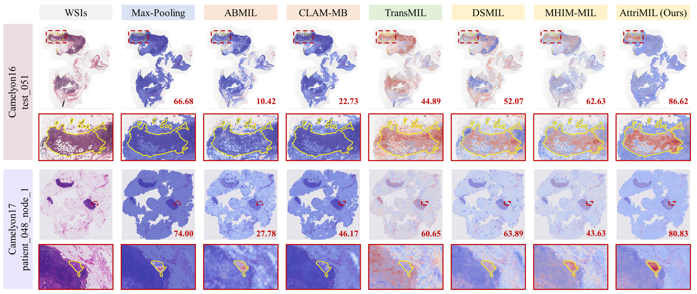

# AttriMIL: Revisiting attention-based multiple instance learning for whole-slide pathological image classification from a perspective of instance attributes
The official implementation of AttriMIL (Pending).

## 1. Introduction
### 1.1 Background
WSI classification typically requires the MIL framework to perform two key tasks: bag classification and instance discrimination, which correspond to clinical diagnosis and the localization of disease-positive regions, respectively. Among various MIL architectures, attention-based MIL frameworks address both tasks simultaneously under weak supervision and thus dominate pathology image analysis. However, attention-based MIL frameworks face two challenges:

(i) The incorrect measure of pathological attributes based on attention, which may confuse diagnosis.

(ii) The negligence of modeling intra-slide and inter-slide interaction, which is essential to obtain robust semantic representation of instances.

<p align="center">
     <br />
    <em> 
    Figure 1. Illustration of the workflow of attention-based MIL frameworks and the attribute scoring mechanism in AttriMIL.
    </em>
</p>

To overcome these issues, we propose a novel framework named attribute-aware multiple instance learning (AttriMIL) tailored for pathological image classification. (i) To identify the pathological attributes of instances, AttriMIL employs a multi-branch attribute scoring mechanism, where each branch integrates attention pooling with the classification head, deriving precise estimation of each instance's contribution to the bag prediction. (ii) Considering the intrinsic correlations between image patches in WSIs, we introduce two constraints to enhance the MIL framework's sensitivity to instance attributes. (iii) Inspired by parameter-efficient fine-tuning techniques, we design a pathology adaptive learning strategy for efficient pathological feature extraction. This optimized backbone empowers AttriMIL to model instance correlations across multiple feature levels.

### 1.2. Framework
Figure 2 presents an overview of AttriMIL, which comprises three main components: (1) a pathology adaptive backbone for extracting optimized instance-level features, (2) multi-branch attribute scoring mechanism with attribute constraints, and (3) score aggregation and bag prediction. In this section, we first revisit multiple instance learning and attention-based frameworks, followed by a detailed description of AttriMIL.

<p align="center">
     <br />
    <em> 
    Figure 2. Overview of the proposed AttriMIL. Given an input WSI, AttriMIL crops it into patches and utilizes a pathology adaptive backbone to obtain optimized instance embeddings. Next, it generates instance attribute scores for each category using a multi-branch attribute scoring mechanism. For a specific branch, WSIs of the same category are treated as positive, while WSIs of other categories are considered negative. During the training phase, attribute constraints are applied to enhance the network's perception of pathological attributes. Finally, AttriMIL performs score aggregation to obtain C bag scores, which are then used to generate bag prediction probabilities..
    </em>
</p>

### 1.3 Performance
AttriMIL achieves the state-of-the-art performance on four benchmarks, showcasing the superior bag classification performance, generalization ability, and instance localization capability. Additionally, AttriMIL is capable of identifying bag with a small proportion of target regions.
<p align="center">
     <br />
    <em> 
    Figure 3. Qualitative comparison of the state-of-the-art WSI classification algorithms.
    </em>
</p>

<p align="center">
     <br />
    <em> 
    Figure 4. Quantative comparison of the state-of-the-art WSI classification algorithms.
    </em>
</p>

## 2. Quick Start
### 2.1 Installation、
AttriMIL is extended from [CLAM]([https://github.com/microsoft/CvT](https://github.com/mahmoodlab/CLAM)).Assuming that you have installed PyTorch and TorchVision, if not, please follow the [officiall instruction](https://pytorch.org/) to install them firstly. 
Intall the dependencies using cmd:
``` sh
conda env create -f env.yml
```
The code is developed and tested using pytorch 1.8.0. Other versions of pytorch are not fully tested.


